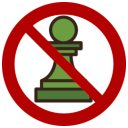

# ChessBlocker

ChessBlocker is a chrome extension with the purpose of restricting time spent on chess without completely stop playing.

## How it works
### Chess.com
The user should configure in the extension options his Chess,com username, and the number of games permitted to play every day.
In the Chess.com website, the extension adds a callback to every button that starts a new game. In that callback, the extension checks with chess.com API that the user didn't reach the current day limit.
## Known Issues
### Chess.com
* Chess.com API supports only getting a user's games from the whole last month. This data can take a few seconds to retrieve, which can delay the button click.
* The games data for a user can take a few seconds to update in Chess.com server, so sometimes when starting a new game, the previous game won't be counted if ended very recently.

## Supported chess websites

- [x] chess.com
- [ ] lichess

## TODO
- [ ] Request from chess.com API to get games per day instead of per month
- [ ] Use dialog inside tab instead of opening a new tab when game limit is reached (when chrome API allows)
- [ ] Add loading animation when it takes a lot of times to retrieve games (when `chrome.action.openPopup` will work in chrome...)
- [ ] Block direct links like `https://www.chess.com/play/online/new?action=createLiveChallenge&base=180&timeIncrement=0`
- [ ] Add browser based counting
- [ ] Restriction based on day of the week
- [ ] Prettier options UI
- [ ] Prettier limit page UI
- [ ] Restriction based on game time format (blitz, bullet...)

## Contributing

`ChessBlocker` is developed at [eronnen/ChessBlocker](https://github.com/eronnen/ChessBlocker). PRs, issues and feature request are welcome.